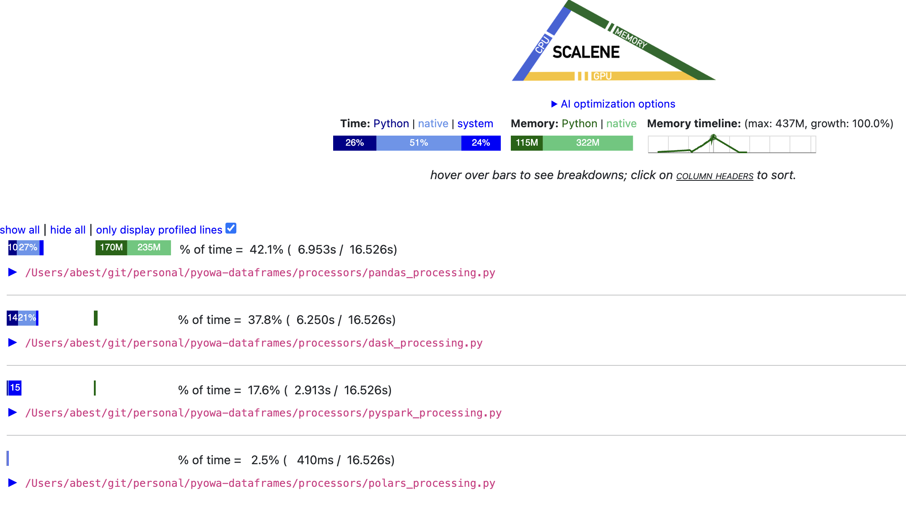

# PyOWA Dataframes

Slides/notebooks/code for PyOWA presentation on Dataframes.

## Slides

[Presentation Slides](./slides/presentation_slides.ipynb)

# Dataframe Comparison

This repo includes a very simple tool for running and comparing different dataframe libraries. When run, it will create some dummy data in ./resouces if it doesn't exist - this can take some time, possibly 5 minutes or so for the largest file.

Then it will run a process function as defined in the main.py file for each dataframe library, and use scalene to compare resource consumption for each. Finally, it will compare the outputs of each library, which is written to ./outputs to ensure each library has the same result.

## To use:

Run comparison:

```
make run
```

Cleanup:

```
make clean
```

After running, it will open up a browser window of the scalene profiling results:


## Notes on benchmarking

I do not expect these to be treated as a good and true benchmark. I'm sure there are things about each library that I could do to improve the performance for each. For the most part this was a "quick and dirty" way to compare these libraries without diving too deep into the weeds.
